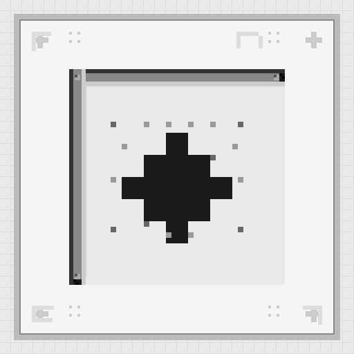

# The Pascal Corner 👋

  

  
  
  
  

> **The Pascal Corner** là một studio game indie nhỏ, nơi những dòng code và ý tưởng sáng tạo gặp nhau. "pascal is here baby"

---

## Về chúng tôi

**The Pascal Corner** là studio game **kind of indie** có trụ sở tại Việt Nam, được thành lập và vận hành bởi **tpc-pascal**. Chúng tôi tập trung vào việc tạo ra những trải nghiệm game nhỏ gọn nhưng có chiều sâu — từ các dòng game cảm động, modding sáng tạo, đến remaking những tựa game quen thuộc dưới góc nhìn mới.

---

## Sản phẩm

| Dự án | Mô tả | Trạng thái |
|-------|-------|------------|
| *Đang cập nhật...* | | |
| *Đang cập nhật...* | | |
| *Đang cập nhật...* | | |
| *Đang cập nhật...* | | |
| *Đang cập nhật...* | | |

---

## Công nghệ

  
  
  
  

---

## Đội ngũ

| Vai trò | Thành viên |
|---------|------------|
| 👨‍💻 Lead Developer / Founder | [tpc-pascal](https://github.com/tpc-pascal) |
| 🎠 Designer | [cuong-no-sleep](https://github.com/cuong-no-sleep) |

---

## Liên hệ

- 🌐 [Linktree](https://linktr.ee/t.p.c)
- 💬 [Discussions](https://github.com/orgs/The-Pascal-Corner/discussions)
- 📧 tpcmemory2005@gmail.com

---

## License

MIT &mdash; xem file [LICENSE](./LICENSE)
